```mermaid
flowchart TD
    classDef root fill:#4a1942,stroke:#fff,color:#fff,stroke-width:3px
    classDef substrate fill:#2d1b69,stroke:#9b59b6,color:#fff
    classDef gauge fill:#1a5276,stroke:#3498db,color:#fff
    classDef em fill:#0e6655,stroke:#1abc9c,color:#fff
    classDef ew fill:#1b4f72,stroke:#2980b9,color:#fff
    classDef qcd fill:#7b241c,stroke:#e74c3c,color:#fff
    classDef mass fill:#6c3483,stroke:#af7ac5,color:#fff
    classDef nuclear fill:#784212,stroke:#e67e22,color:#fff
    classDef gravity fill:#1c2833,stroke:#95a5a6,color:#fff
    classDef cosmo fill:#0b5345,stroke:#27ae60,color:#fff
    classDef atomic fill:#154360,stroke:#5dade2,color:#fff
    classDef fail fill:#641e16,stroke:#e74c3c,color:#fff,stroke-dasharray:5 5
    classDef open fill:#4a235a,stroke:#bb8fce,color:#fff,stroke-dasharray:5 5

    %% ═══════════════════════════════════════════
    %% ROOT: The Double-Well Potential
    %% ═══════════════════════════════════════════

    Vphi["V(φ) = −α/2 φ² + β/4 φ⁴<br/>α = ∛18 · β = 1/(9π)<br/>── TIER 0 POSTULATE ──"]:::root

    %% ═══════════════════════════════════════════
    %% SUBSTRATE PROPERTIES (from V directly)
    %% ═══════════════════════════════════════════

    Vphi --> phi0["φ₀ = √(α/β)<br/>vacuum value · T1"]:::substrate
    Vphi --> xi["ξ = √(2/α) ≈ 0.87 l_Pl<br/>kink width · T1"]:::substrate
    Vphi --> Skink["S_kink = 4α^3/2 / (3√β)<br/>kink action · T1"]:::substrate
    Vphi --> Vvac["V(φ₀) = −α²/(4β) < 0<br/>negative vacuum energy · T1"]:::substrate
    Vphi --> Qtop["Q_top = 2<br/>topological charge · T1"]:::substrate
    Vphi --> I4["I₄ = C₂(fund,SU(3)) = 4/3<br/>Bogomolny integral · T1"]:::substrate

    %% ═══════════════════════════════════════════
    %% GAUGE COUPLING CHAIN
    %% ═══════════════════════════════════════════

    Vphi --> geff["g_eff² = 8πβ/3 = 8/27<br/>common gauge coupling · T2a"]:::gauge
    geff --> alpha_common["α_common = g_eff²/(4π) = 2/(27π)<br/>T2a"]:::gauge
    alpha_common --> inv_alpha_Mc["1/α_em(M_c) = 36π<br/>at unification scale · T2a"]:::gauge

    %% Weinberg angle branch
    geff --> sin2tw["sin²θ_W(M_c) = 3/8<br/>structural prediction · T1"]:::ew
    sin2tw --> sin2tw_MZ["sin²θ_W(M_Z) = 0.2312<br/>RG-evolved · T2a · 0.01%"]:::ew

    %% ═══════════════════════════════════════════
    %% ELECTROMAGNETIC CHAIN
    %% ═══════════════════════════════════════════

    inv_alpha_Mc --> alpha_MZ["1/α_em(M_Z) = 128.09<br/>+0.15% · T2a · 0 free params"]:::em
    alpha_MZ --> alpha_0["1/α_em(0) = 137.23<br/>+0.14% · T2b<br/>hadronic VP blocking T2a"]:::em

    %% QED precision
    alpha_0 --> ae["a_e = 0.001158<br/>electron g−2 · −0.14% · T2a"]:::atomic
    alpha_0 --> lamb["Lamb shift = 1050.5 MHz<br/>−0.69% · T2a"]:::atomic
    alpha_0 --> rydberg["Rydberg / Bohr radius<br/>−0.28% systematic · T2b"]:::atomic
    alpha_0 --> thomson["σ_T = 6.657×10⁻²⁹ m²<br/>+0.08% · T2a"]:::atomic

    %% Stellar from Thomson
    thomson --> eddington["Eddington luminosity<br/>−0.45% · T2a"]:::cosmo
    thomson --> stellar_life["Solar lifetime<br/>+3.6% · T3"]:::cosmo

    %% ═══════════════════════════════════════════
    %% ELECTROWEAK SECTOR
    %% ═══════════════════════════════════════════

    sin2tw_MZ --> MW_tree["M_W = 80.10 GeV<br/>tree-level · −0.34% · T2a"]:::ew
    sin2tw_MZ --> MZ["M_Z = 90.86 GeV<br/>−0.36% · T2a"]:::ew
    sin2tw_MZ --> GF["G_F = 1.168×10⁻⁵ GeV⁻²<br/>+0.18% · T2a"]:::ew

    MW_tree --> MW_loop["M_W = 80.38 GeV<br/>1-loop Sirlin · +0.009% · T2a"]:::ew
    MZ --> Zwidth["Γ_Z = 2456 MeV<br/>−1.56% · T2a"]:::ew
    MZ --> Zinv["Γ_Z(inv) = 493 MeV<br/>−1.16% · T2a"]:::ew

    %% Muon lifetime
    GF --> tau_mu["τ_μ = 2.180 μs<br/>−0.80% · T2a"]:::ew

    %% EW VEV
    geff --> vev["v = 247.83 GeV<br/>EW VEV · +0.65% · T2a"]:::ew

    %% Higgs
    Vphi --> mH["m_H = 124.4 ± 3.7 GeV<br/>+0.7% · T2a · 1 free param"]:::ew

    %% ═══════════════════════════════════════════
    %% STRONG COUPLING / QCD CHAIN
    %% ═══════════════════════════════════════════

    geff --> alpha_s["α_s(M_Z) = 0.11821<br/>ECCC · +0.006% · T2a"]:::qcd
    alpha_s --> LambdaQCD["Λ_QCD = 304.5 MeV<br/>T2a"]:::qcd

    %% String tension and mesons
    Qtop --> sigma["σ = Q_top × Λ_QCD²<br/>= 185,440 MeV² · T3"]:::qcd
    LambdaQCD --> sigma
    sigma --> m_rho["m_ρ = 763.3 MeV<br/>−1.5% · T2a · 0 free params"]:::qcd
    sigma --> regge["Regge trajectory α'<br/>−2.5% · T3"]:::qcd
    sigma --> m_a2["m_a₂ = 1322 MeV · +0.3%<br/>m_ρ₃ = 1707 · m_a₄ = 2019<br/>T2a"]:::qcd

    %% Baryons
    LambdaQCD --> m_proton["m_p = √(3π) Λ_QCD = 934.8 MeV<br/>−0.4% · T3"]:::qcd
    LambdaQCD --> m_delta["m_Δ = √(5π) Λ_QCD = 1206.8 MeV<br/>−2.0% · T3"]:::qcd

    %% Confinement / Yang-Mills
    sigma --> glueball["glueball Δ_4D ≥ 861 MeV<br/>consistent with lattice · T3"]:::qcd

    %% ═══════════════════════════════════════════
    %% MASS SPECTRUM
    %% ═══════════════════════════════════════════

    %% Lepton masses
    Qtop --> koide_t["Koide parameter<br/>t = 1/√Q_top = 1/√2 · T2a"]:::mass
    I4 --> koide_t
    koide_t --> m_tau["m_τ = 1776.97 MeV<br/>+0.006% · T2a · 0 free params"]:::mass

    xi --> mu_me["m_μ/m_e = 206.77<br/>from R/d ratio · T2a"]:::mass

    %% Quark masses
    vev --> M0["M₀ = √(m_u m_d) = 3.261 MeV<br/>Yukawa overlap · T2a"]:::mass
    Skink --> M0
    M0 --> kappa_q["κ_q = πN_c/2<br/>center vortex · T2a"]:::mass
    kappa_q --> m_charm["m_c = 1281 MeV · +0.29%<br/>m_s = 99 MeV · +2.09%<br/>T2a"]:::mass

    %% ═══════════════════════════════════════════
    %% NUCLEAR / HADRONIC PHYSICS
    %% ═══════════════════════════════════════════

    %% g_A is the key nuclear input
    Vphi --> gA["g_A = 4/π = 1.2732<br/>kink Yukawa coupling · T2a"]:::nuclear

    %% f_pi
    LambdaQCD --> fpi["f_π = 90.63 MeV<br/>−1.6% · T2a"]:::nuclear

    %% Neutron lifetime (intersection of nuclear + EW)
    gA --> tau_n["τ_n = 878.0 s<br/>−0.05% · T2a · 0 free params"]:::nuclear
    GF --> tau_n

    %% Magnetic moments
    gA --> mu_ratio["μ_p/μ_n = −3/2 + g_A/32<br/>= −1.4598 · +0.022% · T2a"]:::nuclear

    %% Proton spin
    gA --> proton_spin["Σ = g_A × I₀/I₁ = 0.320<br/>proton spin fraction<br/>−3.2% · T3"]:::nuclear

    %% Nuclear binding
    gA --> sigma_piN["σ_πN = 50.9 MeV<br/>−2.2% · T2b"]:::nuclear
    fpi --> nuclear_binding["Nuclear saturation<br/>a_V = −16.1 MeV · +0.7%<br/>T3"]:::nuclear
    gA --> nuclear_binding

    %% pp fusion (intersection of nuclear + EM)
    gA --> pp_fusion["pp fusion S(0)<br/>= 3.99×10⁻²⁵ · −0.4% · T2a"]:::nuclear
    alpha_0 --> pp_fusion

    %% Pion mass (intersection of quarks + QCD)
    M0 --> m_pion["m_π = 136.9 MeV<br/>−1.9% · T2a<br/>(with lattice condensate)"]:::nuclear
    LambdaQCD --> m_pion

    %% ═══════════════════════════════════════════
    %% GRAVITY
    %% ═══════════════════════════════════════════

    Vvac --> AdS["emergent AdS geometry<br/>k = α√(3π)/4 = 2.011 · T1"]:::gravity
    AdS --> kappa["κ = 1/k = 0.4972<br/>gravitational coupling<br/>−0.57% · T1 · 0 free params"]:::gravity
    kappa --> BH_entropy["BH entropy S/A = 1/(2k)<br/>−0.57% (inherited) · T1"]:::gravity
    AdS --> KK_gravitons["KK graviton m₁ = 7.7 M_Pl<br/>unobservable · T2a"]:::gravity

    %% ═══════════════════════════════════════════
    %% COSMOLOGY
    %% ═══════════════════════════════════════════

    kappa --> H0["H₀ = 67.26 km/s/Mpc<br/>−0.21% · T2a"]:::cosmo

    %% BBN (intersection of nuclear + cosmology)
    tau_n --> Yp["Y_p = 0.2475<br/>BBN He-4 · +1.05% · T2a"]:::cosmo
    gA --> Yp

    Vphi --> Lambda_cosm["ρ_Λ^1/4 = 2.16 meV<br/>−3.5% · T3"]:::cosmo
    Lambda_cosm --> w_Lambda["w_Λ = −0.992<br/>1.3σ Planck · T3"]:::cosmo

    H0 --> CMB_peak["CMB ℓ₁ = 222<br/>+0.9% · T2a"]:::cosmo
    H0 --> BAO["r_drag = 146.70 Mpc<br/>−0.27% · T2a"]:::cosmo
    H0 --> t0["t₀ = 13.780 Gyr<br/>−0.12% · T3"]:::cosmo

    %% ═══════════════════════════════════════════
    %% TOPOLOGY / STRUCTURE
    %% ═══════════════════════════════════════════

    Vphi --> S3["S³ topology<br/>3 generations · T1"]:::substrate
    S3 --> N_gen["N_gen = 3 exactly<br/>no 4th generation · T1"]:::substrate
    Vphi --> strong_CP["θ̄ = 0 exactly<br/>S⁵ CP isometry · T2a"]:::substrate
    Vphi --> proton_stable["proton stable<br/>no gauge decay channel · T1"]:::substrate

    %% ═══════════════════════════════════════════
    %% KNOWN FAILURES / OPEN PROBLEMS
    %% ═══════════════════════════════════════════

    alpha_0 --> alpha_em0_gap["α_em(0) identity<br/>A−B = ln(1/α_em(0))<br/>T4 · BLOCKED"]:::open
    Lambda_cosm --> CC_problem["Λ combination rule<br/>exp(−α) not derived<br/>T4 · STUCK"]:::open
    M0 --> yukawa_sep["D5-D7 depth separation<br/>not derived from dynamics<br/>T4 · OPEN"]:::open
```

# DFC Derivation Dependency Graph

Every quantitative prediction in the DFC model traces back to the double-well potential
V(φ) = −α/2 φ² + β/4 φ⁴ and two derived parameters: α = ∛18 and β = 1/(9π).
This graph shows how physical predictions branch and intersect from that root.

**How to read:** Boxes are derived quantities or predictions. Arrows show which result
feeds into which. Colors indicate physics domain. Dashed borders mark known failures
or open problems. Tier labels (T1, T2a, T3, T4) indicate derivation rigor.

---

---

## Key Intersections

The graph reveals several critical **intersection points** — places where
independently derived quantities must agree:

1. **Neutron lifetime** (τ_n) sits at the intersection of g_A (nuclear/kink topology)
   and G_F (electroweak sector). Both feed from V(φ) through completely different
   paths, yet the predicted 878.0 s matches observation to 0.05%.

2. **BBN abundances** (Y_p) depend on τ_n and g_A, connecting nuclear physics to
   cosmology through the primordial helium fraction.

3. **pp fusion** cross-section requires both g_A (nuclear) and α_em (gauge coupling chain),
   connecting the two main branches at a single measurable quantity.

4. **Pion mass** connects the quark mass derivation (M₀ from Yukawa overlap) to
   Λ_QCD (from gauge coupling RG running) through the GMOR relation.

5. **Meson/baryon masses** all flow from Λ_QCD, which itself descends from g_eff²
   through α_s RG running — the same g_eff² that produces α_em through a different
   RG path.

## Branch Structure

From V(φ), three main branches diverge:

| Branch | Key intermediary | Terminal predictions |
|---|---|---|
| **Electromagnetic** | g_eff → α_em(M_Z) → α_em(0) | a_e, Lamb shift, Thomson, stellar physics |
| **Electroweak** | sin²θ_W → M_W, M_Z, G_F | τ_μ, Γ_Z, VEV, Higgs mass |
| **QCD/Hadronic** | α_s → Λ_QCD → σ | meson tower, baryons, nuclear binding |

These branches **reconverge** at nuclear physics (τ_n needs G_F + g_A),
cosmology (BBN needs τ_n + H₀), and precision tests (Lamb shift needs α_em
from the gauge chain).

## Open Problems (dashed borders in graph)

Three quantities remain underived (T4):
- **α_em(0) identity**: the structural identity A−B = ln(1/α_em(0)) is known but
  not proven algebraically
- **Cosmological constant combination rule**: why exp(−α) appears in the Λ formula
- **Yukawa depth separation**: the D5-D7 separation that sets light quark masses

---

*This graph is generated from the equation modules in `equations/`. See
`educational/06_predictions.md` for the full prediction scorecard with error
bars and tier assessments.*
