```mermaid
flowchart TD
    classDef root fill:#4a1942,stroke:#fff,color:#fff,stroke-width:3px
    classDef substrate fill:#2d1b69,stroke:#9b59b6,color:#fff
    classDef gauge fill:#1a5276,stroke:#3498db,color:#fff
    classDef em fill:#0e6655,stroke:#1abc9c,color:#fff
    classDef ew fill:#1b4f72,stroke:#2980b9,color:#fff
    classDef qcd fill:#7b241c,stroke:#e74c3c,color:#fff
    classDef mass fill:#6c3483,stroke:#af7ac5,color:#fff
    classDef nuclear fill:#784212,stroke:#e67e22,color:#fff
    classDef gravity fill:#1c2833,stroke:#95a5a6,color:#fff
    classDef cosmo fill:#0b5345,stroke:#27ae60,color:#fff
    classDef pred fill:#7d6608,stroke:#f1c40f,color:#fff,stroke-width:2px
    classDef fail fill:#641e16,stroke:#e74c3c,color:#fff,stroke-dasharray:5 5
    classDef open fill:#4a235a,stroke:#bb8fce,color:#fff,stroke-dasharray:5 5
    classDef absence fill:#1a5276,stroke:#f39c12,color:#fff,stroke-width:2px,stroke-dasharray:8 4

    %% ════════════════════════════════════════════════════
    %% ROOT
    %% ════════════════════════════════════════════════════

    Vphi["V(φ) = −α/2 φ² + β/4 φ⁴<br/>α = ∛18 · β = 1/(9π)<br/>── TIER 0 POSTULATE ──"]:::root

    %% ════════════════════════════════════════════════════
    %% SUBSTRATE PROPERTIES
    %% ════════════════════════════════════════════════════

    Vphi --> phi0["φ₀ = √(α/β)<br/>vacuum value · T1"]:::substrate
    Vphi --> xi["ξ = √(2/α) ≈ 0.87 l_Pl<br/>kink width · T1"]:::substrate
    Vphi --> Skink["S_kink<br/>kink action · T1"]:::substrate
    Vphi --> Vvac["V(φ₀) = −α²/(4β) &lt; 0<br/>negative vacuum energy · T1"]:::substrate
    Vphi --> Qtop["Q_top = 2<br/>topological charge · T1"]:::substrate
    Vphi --> I4["I₄ = 4/3<br/>Bogomolny integral · T1"]:::substrate
    Vphi --> S3["S³ topology<br/>from bifurcation · T1"]:::substrate
    Vphi --> S5["S⁵ ⊂ ℂ³<br/>D7 vacuum manifold · T1"]:::substrate

    %% ════════════════════════════════════════════════════
    %% GAUGE COUPLING CHAIN
    %% ════════════════════════════════════════════════════

    Vphi --> geff["g_eff² = 8πβ/3 = 8/27<br/>common gauge coupling · T2a"]:::gauge
    geff --> alpha_common["α_common = 2/(27π)<br/>T2a"]:::gauge
    alpha_common --> inv36pi["1/α_em(M_c) = 36π<br/>unification scale · T2a"]:::gauge

    %% Weinberg angle
    geff --> sin2tw["sin²θ_W(M_c) = 3/8<br/>structural · T1"]:::ew
    sin2tw --> P_sin2tw["sin²θ_W(M_Z) = 0.2312<br/>0.01% · T2a"]:::pred

    %% ════════════════════════════════════════════════════
    %% ELECTROMAGNETIC CHAIN
    %% ════════════════════════════════════════════════════

    inv36pi --> P_alpha_MZ["1/α_em(M_Z) = 128.09<br/>+0.15% · T2a"]:::pred
    P_alpha_MZ --> P_alpha_0["1/α_em(0) = 137.23<br/>+0.14% · T2b"]:::pred

    %% QED precision predictions
    P_alpha_0 --> P_ae["a_e = 0.001158<br/>electron g−2 · −0.14% · T2a"]:::pred
    P_alpha_0 --> P_lamb["Lamb shift = 1050.5 MHz<br/>−0.69% · T2a"]:::pred
    P_alpha_0 --> P_rydberg["R_∞ = 10,943,365 m⁻¹<br/>−0.28% · T2b"]:::pred
    P_alpha_0 --> P_bohr["a₀ = 52.991 pm<br/>+0.14% · T2b"]:::pred
    P_alpha_0 --> P_E1["E₁ = −13.568 eV<br/>−0.22% · T2b"]:::pred
    P_alpha_0 --> P_finestr["Fine structure 2P<br/>10,889 MHz · −0.73% · T2b"]:::pred
    P_alpha_0 --> P_hyperfine["Hyperfine 1S (21 cm)<br/>1413.3 MHz · −0.50% · T2b"]:::pred
    P_alpha_0 --> P_thomson["σ_T = 6.657×10⁻²⁹ m²<br/>+0.08% · T2a"]:::pred
    P_alpha_0 --> P_eradius["Classical e⁻ radius<br/>2.814×10⁻¹⁵ m · −0.14% · T2b"]:::pred

    %% Stellar predictions (from Thomson)
    P_thomson --> P_kappa_es["κ_es = 0.3372 cm²/g<br/>+0.45% · T2a"]:::pred
    P_kappa_es --> P_eddington["L_Edd · −0.45% · T2a"]:::pred
    P_kappa_es --> P_WD_radius["WD radius (1 M_⊙)<br/>+0.62% · T3"]:::pred
    P_kappa_es --> P_HBMM["Min H-burning mass<br/>0.0803 M_⊙ · +0.4% · T3"]:::pred
    P_kappa_es --> P_solar_life["Solar MS lifetime<br/>10.4 Gyr · +3.6% · T3"]:::pred

    %% ════════════════════════════════════════════════════
    %% ELECTROWEAK SECTOR
    %% ════════════════════════════════════════════════════

    P_sin2tw --> P_MW_tree["M_W = 80.10 GeV<br/>tree · −0.34% · T2a"]:::pred
    P_sin2tw --> P_MZ["M_Z = 90.86 GeV<br/>−0.36% · T2a"]:::pred
    P_sin2tw --> P_GF["G_F = 1.168×10⁻⁵ GeV⁻²<br/>+0.18% · T2a"]:::pred

    P_MW_tree --> P_MW_loop["M_W = 80.38 GeV<br/>1-loop · +0.009% · T2a"]:::pred

    P_MZ --> P_Zwidth["Γ_Z = 2456 MeV<br/>−1.56% · T2a"]:::pred
    P_MZ --> P_Zinv["Γ_Z(inv) = 493 MeV<br/>−1.16% · T2a"]:::pred
    P_MZ --> P_Rl["R_l = 20.746<br/>−0.10% · T2a"]:::pred

    P_GF --> P_tau_mu["τ_μ = 2.180 μs<br/>−0.80% · T2a"]:::pred

    %% EW VEV and Higgs
    geff --> P_vev["v = 247.83 GeV<br/>EW VEV · +0.65% · T2a"]:::pred
    Vphi --> P_mH["m_H = 124.4 GeV<br/>+0.7% · T2a"]:::pred

    %% ════════════════════════════════════════════════════
    %% STRONG COUPLING / QCD CHAIN
    %% ════════════════════════════════════════════════════

    geff --> P_alpha_s["α_s(M_Z) = 0.11821<br/>ECCC · +0.006% · T2a"]:::pred
    geff --> P_alpha_s_pure["α_s(M_Z) = 0.11566<br/>DFC-alone · −2.15% · T2a"]:::pred

    P_alpha_s --> LambdaQCD["Λ_QCD = 304.5 MeV<br/>T2a"]:::qcd

    %% String tension
    Qtop --> sigma["σ = Q_top × Λ²<br/>string tension · T3"]:::qcd
    LambdaQCD --> sigma

    %% Meson spectrum
    sigma --> P_m_rho["m_ρ = 763.3 MeV<br/>−1.5% · T2a"]:::pred
    sigma --> P_m_omega["m_ω = 763.3 MeV<br/>−2.48% · T2a"]:::pred
    sigma --> P_m_a2["m_a₂ = 1322 MeV<br/>+0.3% · T2a"]:::pred
    sigma --> P_m_rho3["m_ρ₃ = 1707 MeV<br/>+1.1% · T2a"]:::pred
    sigma --> P_m_a4["m_a₄ = 2019 MeV<br/>+1.2% · T2a"]:::pred
    P_m_rho --> P_ratio_a2_rho["m_a₂/m_ρ = √3<br/>+1.9% · T2a"]:::pred
    P_m_a2 --> P_ratio_a2_rho

    %% Quarkonium
    sigma --> P_upsilon["Υ(1S) = 9752 MeV<br/>+3.1% · T3"]:::pred
    P_alpha_s --> P_upsilon
    sigma --> P_jpsi["J/ψ = 3739 MeV<br/>+21% · T3"]:::fail
    P_alpha_s --> P_jpsi

    %% Baryon masses
    LambdaQCD --> P_m_proton["m_p = √(3π) Λ = 934.8 MeV<br/>−0.4% · T3"]:::pred
    LambdaQCD --> P_m_delta["m_Δ = √(5π) Λ = 1206.8 MeV<br/>−2.0% · T3"]:::pred
    P_m_proton --> P_delta_N["m_Δ − m_N = 272 MeV<br/>−7.4% · T3"]:::pred
    P_m_delta --> P_delta_N
    P_m_proton --> P_ratio_mN_mrho["m_N/m_ρ = √(3/2)<br/>+1.20% · T3"]:::pred
    P_m_rho --> P_ratio_mN_mrho
    P_m_proton --> P_ratio_mD_mN["m_Δ/m_N = √(5/3)<br/>−1.7% · T3"]:::pred
    P_m_delta --> P_ratio_mD_mN

    %% Glueball / confinement
    sigma --> P_glueball["Glueball Δ ≥ 861 MeV<br/>consistent · T3"]:::pred

    %% ════════════════════════════════════════════════════
    %% MASS SPECTRUM
    %% ════════════════════════════════════════════════════

    %% Y-junction Casimir
    Vphi --> P_E0_Yjunc["E₀(Y-junction) = 0<br/>N_c = 3 selection · T1"]:::pred

    %% Lepton masses
    Qtop --> koide_t["Koide t = 1/√Q_top<br/>= 1/√2 · T2a"]:::mass
    I4 --> koide_t
    koide_t --> P_m_tau["m_τ = 1776.97 MeV<br/>+0.006% · T2a"]:::pred
    xi --> P_mu_me["m_μ/m_e = 206.77<br/>T2a"]:::pred

    %% Quark masses
    P_vev --> M0["Yukawa overlap<br/>y = exp(−(b₀+1/α))"]:::mass
    Skink --> M0
    M0 --> P_M0["M₀ = √(m_u m_d) = 3.261 MeV<br/>+2.68% · T2a"]:::pred
    P_M0 --> kappa_q["κ_q = πN_c/2<br/>center vortex · T2a"]:::mass
    kappa_q --> P_m_charm["m_c = 1281 MeV<br/>+0.29% · T2a"]:::pred
    kappa_q --> P_m_strange["m_s = 99 MeV<br/>+2.09% · T2a"]:::pred

    %% Neutrino masses
    xi --> P_mnu_uncorr["m₃/m₂ = 5.33<br/>−8.3% · T2b"]:::pred
    P_mnu_uncorr --> P_mnu_corr["m₃/m₂ = 5.8248<br/>color-corrected · +0.010% · T3"]:::pred

    %% ════════════════════════════════════════════════════
    %% NUCLEAR / HADRONIC PHYSICS
    %% ════════════════════════════════════════════════════

    Vphi --> P_gA["g_A = 4/π = 1.2732<br/>kink Yukawa · −0.19% · T2a"]:::pred

    LambdaQCD --> P_fpi["f_π = 90.63 MeV<br/>−1.6% · T2a"]:::pred

    %% Neutron lifetime (intersection!)
    P_gA --> P_tau_n["τ_n = 878.0 s<br/>−0.05% · T2a · 0 free params"]:::pred
    P_GF --> P_tau_n

    %% Magnetic moments
    P_gA --> P_mu_ratio["μ_p/μ_n = −3/2 + g_A/32<br/>= −1.4598 · +0.022% · T2a"]:::pred
    P_gA --> P_mu_p["μ_p = 2.833 n.m.<br/>+1.4% · T2a"]:::pred
    P_gA --> P_mu_n["μ_n = −1.888 n.m.<br/>−1.3% · T2a"]:::pred

    %% Proton spin
    P_gA --> P_proton_spin["Σ = 0.320<br/>proton spin · −3.2% · T3"]:::pred

    %% Pion-nucleon
    P_gA --> P_g_piNN["g_πNN = 12.28<br/>−6.4% · T3"]:::pred
    P_gA --> P_sigma_piN["σ_πN = 50.9 MeV<br/>−2.2% · T2b"]:::pred

    %% Nuclear binding
    P_fpi --> P_nuclear_bind["Nuclear saturation<br/>a_V = −16.1 MeV · +0.7% · T3"]:::pred
    P_gA --> P_nuclear_bind
    P_gA --> P_sym_energy["Symmetry energy J<br/>34.9 MeV · +9.2% · T3"]:::pred
    P_gA --> P_mirror_CDE["Mirror nuclei CDEs<br/>7.2% RMS · T3"]:::pred
    P_gA --> P_nolen_schiffer["Nolen-Schiffer<br/>67% closed · T3"]:::pred

    %% pp fusion (intersection!)
    P_gA --> P_pp_fusion["pp S(0) = 3.99×10⁻²⁵<br/>−0.4% · T2a"]:::pred
    P_alpha_0 --> P_pp_fusion

    %% Pion mass (intersection!)
    P_M0 --> P_m_pion["m_π = 136.9 MeV<br/>−1.9% · T2a"]:::pred
    LambdaQCD --> P_m_pion

    %% Proton-neutron mass difference
    P_M0 --> P_delta_m_np["Δm(n−p) = 1.289 MeV<br/>−0.4% · T2b"]:::pred

    %% Proton charge radius
    P_gA --> P_rp["r_p = 0.854 fm<br/>+1.5% · T3"]:::pred

    %% Neutrino mixing angle
    S3 --> P_theta23["θ₂₃ = arctan(exp(1/(2π)))<br/>= 49.54° · +0.28° · T3"]:::pred

    %% ════════════════════════════════════════════════════
    %% GRAVITY
    %% ════════════════════════════════════════════════════

    Vvac --> AdS["emergent AdS · k = 2.011<br/>T1"]:::gravity
    AdS --> P_kappa["κ = 1/k = 0.4972<br/>grav coupling · −0.57% · T1"]:::pred
    P_kappa --> P_BH_entropy["BH entropy S/A = 1/(2k)<br/>−0.57% · T1"]:::pred
    AdS --> P_KK_grav["KK graviton m₁ = 7.7 M_Pl<br/>unobservable · T2a"]:::pred

    %% ════════════════════════════════════════════════════
    %% COSMOLOGY
    %% ════════════════════════════════════════════════════

    P_kappa --> P_H0["H₀ = 67.26 km/s/Mpc<br/>−0.21% · T2a"]:::pred

    %% BBN (intersection of nuclear + cosmo)
    P_tau_n --> P_Yp["Y_p = 0.2475<br/>He-4 · +1.05% · T2a"]:::pred
    P_gA --> P_Yp
    P_Yp --> P_DH["D/H = 2.438×10⁻⁵<br/>−3.5% · T3"]:::pred
    P_Yp --> P_He3H["He-3/H = 1.04×10⁻⁵<br/>−5.5% · T3"]:::pred

    %% Dark energy
    Vphi --> P_Lambda_cosm["ρ_Λ^(1/4) = 2.16 meV<br/>−3.5% · T3"]:::pred
    P_Lambda_cosm --> P_Lambda_exp["ρ_Λ exponent = 283.24<br/>+0.05% · T3"]:::pred
    P_Lambda_cosm --> P_w_Lambda["w_Λ = −0.992<br/>1.3σ · T3"]:::pred

    %% CMB
    P_H0 --> P_CMB_ell1["CMB ℓ₁ = 222<br/>+0.9% · T2a"]:::pred
    P_H0 --> P_theta_star["θ_* = 1.0375<br/>−0.35% · T2a"]:::pred
    P_H0 --> P_rs["r_s = 143.87 Mpc<br/>−0.39% · T2a"]:::pred
    P_H0 --> P_BAO["r_drag = 146.70 Mpc<br/>−0.27% · T2a"]:::pred
    P_H0 --> P_t0["t₀ = 13.780 Gyr<br/>−0.12% · T3"]:::pred
    P_H0 --> P_Omega_k["Ω_k = 0<br/>exact · T2a"]:::pred

    %% Neutrino species
    S3 --> P_Neff["N_eff = 3.044<br/>0.3σ · T1"]:::pred

    %% Dark matter (T4)
    Vphi --> P_mDM["m_DM = 35.6 keV<br/>T4 · open"]:::open
    P_mDM --> P_lambda_fs["λ_fs = 1.0 kpc<br/>T4 · open"]:::open

    %% ════════════════════════════════════════════════════
    %% ABSENCE PREDICTIONS
    %% ════════════════════════════════════════════════════

    S5 --> P_strong_CP["θ̄ = 0 exactly<br/>strong CP solved · T2a"]:::absence
    P_strong_CP --> P_no_axion["No axion · T2a"]:::absence
    P_strong_CP --> P_dn0["d_n = 0 exactly · T2a"]:::absence
    S3 --> P_3gen["N_gen = 3 exactly · T1"]:::absence
    Vphi --> P_proton_stable["Proton stable · T1"]:::absence
    Vphi --> P_no_SUSY["No SUSY · T3"]:::absence

    %% ════════════════════════════════════════════════════
    %% OPEN PROBLEMS
    %% ════════════════════════════════════════════════════

    P_alpha_0 --> alpha_em0_gap["α_em(0) identity<br/>A−B = ln(1/α_em(0))<br/>T4 · BLOCKED"]:::open
    P_Lambda_cosm --> CC_problem["Λ combination rule<br/>exp(−α) not derived<br/>T4 · STUCK"]:::open
    M0 --> yukawa_sep["D5-D7 depth separation<br/>not derived · T4"]:::open
```

# DFC Derivation Dependency Graph

Every quantitative prediction in the DFC model traces back to the double-well potential
V(φ) = −α/2 φ² + β/4 φ⁴ and two derived parameters: α = ∛18 and β = 1/(9π).
This graph shows how physical predictions branch and intersect from that root.

**How to read this graph:**
- **Dark purple** = the root postulate V(φ)
- **Blue-purple** = substrate properties derived directly from V(φ)
- **Domain colors** = intermediate derivation steps (gauge, EW, QCD, nuclear, gravity, cosmology)
- **Gold nodes** = scorecard predictions — quantities compared to experiment
- **Red dashed** = known failures or open problems
- Arrows show which result feeds into which

---

---

## Legend

| Color | Meaning |
|---|---|
| **Dark purple** | Root postulate — V(φ) |
| **Blue-purple** | Substrate properties (φ₀, ξ, S_kink, Q_top, I₄, S³, S⁵) |
| **Domain colors** (blue, red, brown, dark) | Intermediate derivation steps |
| **Gold** | Scorecard predictions — compared to experiment |
| **Gold with dash-dot border** | Absence predictions — things DFC says do NOT exist |
| **Red dashed** | Known failures (>10% error) |
| **Purple dashed** | Open problems (T4, blocked or stuck) |

## Key Intersections

The graph reveals places where independently derived quantities must converge:

| Intersection | Branches meeting | Prediction | Error |
|---|---|---|---|
| **τ_n** (neutron lifetime) | g_A (nuclear) + G_F (electroweak) | 878.0 s | −0.05% |
| **Y_p** (BBN He-4) | τ_n (nuclear) + cosmology | 0.2475 | +1.05% |
| **pp fusion** | g_A (nuclear) + α_em (gauge chain) | 3.99×10⁻²⁵ | −0.4% |
| **m_π** (pion mass) | M₀ (quark masses) + Λ_QCD (QCD chain) | 136.9 MeV | −1.9% |
| **m_N/m_ρ** | baryon (Y-junction) + meson (Regge) | √(3/2) | +1.20% |

## Branch Distance

Predictions that are **far apart** on the graph yet both accurate provide the
strongest evidence for V(φ), because their derivation chains share almost no
intermediate steps:

| Pair | Graph distance | Both accurate? |
|---|---|---|
| a_e (electron g−2) ↔ τ_n (neutron lifetime) | 6 steps apart | Both <0.2% |
| κ (gravity) ↔ α_s (strong coupling) | 5 steps apart | Both <1% |
| m_τ (Koide) ↔ m_ρ (rho meson) | 7 steps apart | Both <2% |
| H₀ (Hubble) ↔ m_c (charm mass) | 8 steps apart | Both <1% |

---

*Every gold node traces back to V(φ) through the arrows. The graph contains
all entries from the prediction scorecard in `educational/06_predictions.md`.*
