```mermaid
flowchart TD
    classDef root fill:#4a1942,stroke:#fff,color:#fff,stroke-width:3px
    classDef substrate fill:#2d1b69,stroke:#9b59b6,color:#fff
    classDef gauge fill:#1a5276,stroke:#3498db,color:#fff
    classDef em fill:#0e6655,stroke:#1abc9c,color:#fff
    classDef ew fill:#1b4f72,stroke:#2980b9,color:#fff
    classDef qcd fill:#7b241c,stroke:#e74c3c,color:#fff
    classDef mass fill:#6c3483,stroke:#af7ac5,color:#fff
    classDef nuclear fill:#784212,stroke:#e67e22,color:#fff
    classDef gravity fill:#1c2833,stroke:#95a5a6,color:#fff
    classDef cosmo fill:#0b5345,stroke:#27ae60,color:#fff
    classDef gold fill:#7d6608,stroke:#f1c40f,color:#fff,stroke-width:3px
    classDef fail fill:#641e16,stroke:#e74c3c,color:#fff,stroke-dasharray:5 5
    classDef open fill:#4a235a,stroke:#bb8fce,color:#fff,stroke-dasharray:5 5

    %% ════════════════════════════════════════════════
    %% ROOT
    %% ════════════════════════════════════════════════

    Vphi["V(φ) = −α/2 φ² + β/4 φ⁴<br/>α = ∛18 · β = 1/(9π)<br/>── THE STARTING POINT ──"]:::root

    %% ════════════════════════════════════════════════
    %% SUBSTRATE PROPERTIES (from V directly)
    %% ════════════════════════════════════════════════

    Vphi --> phi0["φ₀ = √(α/β)<br/>vacuum value"]:::substrate
    Vphi --> xi["ξ = √(2/α)<br/>kink width ≈ Planck length"]:::substrate
    Vphi --> Skink["S_kink<br/>kink action"]:::substrate
    Vphi --> Vvac["V(φ₀) &lt; 0<br/>negative vacuum energy"]:::substrate
    Vphi --> Qtop["Q_top = 2<br/>topological charge"]:::substrate
    Vphi --> I4["I₄ = 4/3<br/>Casimir invariant"]:::substrate
    Vphi --> S3topo["S³ topology<br/>from bifurcation"]:::substrate
    Vphi --> S5topo["S⁵ vacuum manifold<br/>at D7 depth"]:::substrate

    %% ════════════════════════════════════════════════
    %% GAUGE COUPLING CHAIN
    %% ════════════════════════════════════════════════

    Vphi --> geff["g_eff² = 8πβ/3 = 8/27<br/>common gauge coupling"]:::gauge
    geff --> alpha_common["α_common = 2/(27π)<br/>coupling at unification"]:::gauge
    alpha_common --> inv36pi["1/α(M_c) = 36π<br/>unification scale"]:::gauge

    %% ════════════════════════════════════════════════
    %% ELECTROMAGNETISM — "1/137"
    %% ════════════════════════════════════════════════

    inv36pi --> GOLD_alpha_em["THE FINE STRUCTURE CONSTANT<br/>α = 1/137.23<br/>strength of electromagnetism<br/>+0.14%"]:::gold

    %% QED precision — electron g-2 is THE famous prediction
    GOLD_alpha_em --> GOLD_ae["ELECTRON g−2<br/>a_e = 0.001158<br/>most precisely tested prediction<br/>−0.14%"]:::gold

    %% Atomic physics
    GOLD_alpha_em --> GOLD_hydrogen["HYDROGEN GROUND STATE<br/>E₁ = −13.568 eV<br/>−0.22%"]:::gold
    GOLD_alpha_em --> GOLD_lamb["LAMB SHIFT<br/>1050.5 MHz<br/>triumph of QED<br/>−0.69%"]:::gold
    GOLD_alpha_em --> atomic_tower["Rydberg · Bohr radius<br/>fine structure · 21 cm line<br/>Thomson cross-section"]:::em
    atomic_tower --> stellar["Eddington luminosity<br/>stellar lifetimes<br/>white dwarf radii"]:::em

    %% ════════════════════════════════════════════════
    %% WEAK FORCE — Weinberg angle, W, Z, Higgs
    %% ════════════════════════════════════════════════

    geff --> sin2tw["sin²θ_W(M_c) = 3/8<br/>structural prediction"]:::ew
    sin2tw --> GOLD_weinberg["WEINBERG ANGLE<br/>sin²θ_W = 0.2312<br/>weak force mixing<br/>0.01%"]:::gold

    GOLD_weinberg --> GOLD_MW["W BOSON MASS<br/>M_W = 80.38 GeV<br/>carrier of weak force<br/>+0.009%"]:::gold
    GOLD_weinberg --> GOLD_MZ["Z BOSON MASS<br/>M_Z = 90.86 GeV<br/>neutral weak carrier<br/>−0.36%"]:::gold
    GOLD_weinberg --> GOLD_GF["FERMI CONSTANT<br/>G_F = 1.168×10⁻⁵ GeV⁻²<br/>weak interaction strength<br/>+0.18%"]:::gold

    GOLD_MZ --> z_decays["Z decay width · invisible width<br/>R_l · R_b · A_FB"]:::ew

    GOLD_GF --> GOLD_muon_life["MUON LIFETIME<br/>τ_μ = 2.180 μs<br/>−0.80%"]:::gold

    Vphi --> GOLD_mH["HIGGS BOSON MASS<br/>m_H = 124.4 GeV<br/>origin of mass<br/>+0.7%"]:::gold

    geff --> GOLD_vev["ELECTROWEAK SCALE<br/>v = 247.83 GeV<br/>vacuum expectation value<br/>+0.65%"]:::gold

    %% ════════════════════════════════════════════════
    %% STRONG FORCE — α_s, QCD, hadrons
    %% ════════════════════════════════════════════════

    geff --> GOLD_alpha_s["STRONG COUPLING CONSTANT<br/>α_s = 0.11821<br/>strength of nuclear force<br/>+0.006%"]:::gold

    GOLD_alpha_s --> LambdaQCD["Λ_QCD = 304.5 MeV<br/>confinement scale"]:::qcd

    Qtop --> sigma["σ = Q_top × Λ²<br/>string tension"]:::qcd
    LambdaQCD --> sigma

    sigma --> GOLD_m_rho["RHO MESON MASS<br/>m_ρ = 763.3 MeV<br/>−1.5%"]:::gold
    sigma --> meson_tower["ω · a₂ · ρ₃ · a₄<br/>full Regge tower<br/>all within 2.5%"]:::qcd

    %% Baryons
    LambdaQCD --> GOLD_m_proton["PROTON MASS<br/>m_p = 934.8 MeV<br/>99.9% of visible matter<br/>−0.4%"]:::gold
    LambdaQCD --> m_delta["Δ(1232) baryon<br/>m_Δ = 1206.8 MeV · −2.0%"]:::qcd
    GOLD_m_proton --> mass_ratios["m_N/m_ρ = √(3/2) · +1.2%<br/>m_Δ/m_N = √(5/3) · −1.7%"]:::qcd

    %% Quarkonium
    sigma --> quarkonium["Υ(1S) = 9752 MeV · +3.1%<br/>J/ψ = 3739 MeV · +21%"]:::fail

    %% Glueball
    sigma --> GOLD_glueball["YANG-MILLS MASS GAP<br/>Δ ≥ 861 MeV<br/>confinement bound"]:::gold

    %% N_c selection
    Vphi --> GOLD_Nc_select["WHY 3 COLORS?<br/>E₀(Y-junction) = 0<br/>only for N_c = 3"]:::gold

    %% ════════════════════════════════════════════════
    %% PARTICLE MASSES
    %% ════════════════════════════════════════════════

    %% Leptons
    Qtop --> koide_t["Koide phase<br/>t = 1/√Q_top"]:::mass
    I4 --> koide_t
    koide_t --> GOLD_m_tau["TAU LEPTON MASS<br/>m_τ = 1776.97 MeV<br/>+0.006%"]:::gold

    xi --> GOLD_mu_me["MUON/ELECTRON MASS RATIO<br/>m_μ/m_e = 206.77"]:::gold

    %% Quarks
    GOLD_vev --> yukawa["Yukawa overlap<br/>y = exp(−(b₀+1/α))"]:::mass
    Skink --> yukawa
    yukawa --> GOLD_M0["LIGHT QUARK MASSES<br/>M₀ = 3.261 MeV · +2.68%"]:::gold
    GOLD_M0 --> kappa_q["κ_q = πN_c/2<br/>center vortex"]:::mass
    kappa_q --> GOLD_m_charm["CHARM QUARK MASS<br/>m_c = 1281 MeV · +0.29%"]:::gold
    kappa_q --> GOLD_m_strange["STRANGE QUARK MASS<br/>m_s = 99 MeV · +2.09%"]:::gold

    %% Neutrinos
    xi --> nu_masses["Neutrino mass ratio<br/>m₃/m₂ = 5.8248 · +0.01%"]:::mass
    S3topo --> GOLD_theta23["NEUTRINO MIXING ANGLE<br/>θ₂₃ = 49.54° · +0.28°"]:::gold

    %% ════════════════════════════════════════════════
    %% NUCLEAR PHYSICS
    %% ════════════════════════════════════════════════

    Vphi --> GOLD_gA["AXIAL COUPLING<br/>g_A = 4/π = 1.2732<br/>governs nuclear β-decay<br/>−0.19%"]:::gold

    LambdaQCD --> GOLD_fpi["PION DECAY CONSTANT<br/>f_π = 90.63 MeV<br/>−1.6%"]:::gold

    %% Neutron lifetime — KEY INTERSECTION
    GOLD_gA --> GOLD_tau_n["NEUTRON LIFETIME<br/>τ_n = 878.0 s<br/>−0.05% · 0 free params"]:::gold
    GOLD_GF --> GOLD_tau_n

    %% Pion mass — KEY INTERSECTION
    GOLD_M0 --> GOLD_m_pion["PION MASS<br/>m_π = 136.9 MeV<br/>lightest hadron · −1.9%"]:::gold
    LambdaQCD --> GOLD_m_pion

    %% Magnetic moments
    GOLD_gA --> GOLD_mag_moments["NUCLEON MAGNETIC MOMENTS<br/>μ_p = 2.833 n.m. · +1.4%<br/>μ_n = −1.888 n.m. · −1.3%<br/>ratio = −3/2 + g_A/32 · 0.022%"]:::gold

    %% Other nuclear
    GOLD_gA --> nuclear_detail["Proton spin Σ = 0.320 · −3.2%<br/>σ_πN = 50.9 MeV · −2.2%<br/>g_πNN · symmetry energy J<br/>pp fusion · nuclear binding"]:::nuclear
    GOLD_fpi --> nuclear_detail

    %% pp fusion — intersection
    GOLD_gA --> pp_fusion["pp fusion S(0)<br/>3.99×10⁻²⁵ · −0.4%"]:::nuclear
    GOLD_alpha_em --> pp_fusion

    %% Proton charge radius, mass difference
    GOLD_M0 --> nuclear_masses["Δm(n−p) = 1.289 MeV · −0.4%<br/>r_p = 0.854 fm · +1.5%"]:::nuclear

    %% ════════════════════════════════════════════════
    %% GRAVITY
    %% ════════════════════════════════════════════════

    Vvac --> AdS["emergent AdS geometry<br/>k = α√(3π)/4"]:::gravity
    AdS --> GOLD_GN["NEWTON'S GRAVITATIONAL CONSTANT<br/>κ = 1/k = 0.4972<br/>−0.57% · 0 free params"]:::gold
    GOLD_GN --> bh_entropy["Black hole entropy<br/>S/A = 1/(2k) · −0.57%"]:::gravity
    AdS --> kk_gravitons["KK gravitons<br/>m₁ = 7.7 M_Pl<br/>unobservable"]:::gravity

    %% ════════════════════════════════════════════════
    %% COSMOLOGY
    %% ════════════════════════════════════════════════

    GOLD_GN --> GOLD_H0["HUBBLE CONSTANT<br/>H₀ = 67.26 km/s/Mpc<br/>expansion rate of the universe<br/>−0.21%"]:::gold

    %% BBN — intersection of nuclear + cosmology
    GOLD_tau_n --> GOLD_Yp["PRIMORDIAL HELIUM<br/>Y_p = 0.2475<br/>Big Bang nucleosynthesis<br/>+1.05%"]:::gold
    GOLD_gA --> GOLD_Yp
    GOLD_Yp --> bbn_detail["D/H · He-3/H<br/>lithium problem persists"]:::cosmo

    %% Dark energy
    Vphi --> GOLD_Lambda["COSMOLOGICAL CONSTANT<br/>ρ_Λ^(1/4) = 2.16 meV<br/>dark energy density<br/>−3.5%"]:::gold
    GOLD_Lambda --> dark_energy_detail["w_Λ = −0.992 · 1.3σ<br/>Λ exponent = 283.24 · +0.05%"]:::cosmo

    %% CMB and large-scale structure
    GOLD_H0 --> GOLD_CMB["CMB FIRST PEAK<br/>ℓ₁ = 222<br/>cosmic microwave background<br/>+0.9%"]:::gold
    GOLD_H0 --> GOLD_t0["AGE OF THE UNIVERSE<br/>t₀ = 13.780 Gyr<br/>−0.12%"]:::gold
    GOLD_H0 --> cmb_detail["θ_* · r_s · r_drag<br/>Ω_k = 0 · BAO scale"]:::cosmo

    %% ════════════════════════════════════════════════
    %% STRUCTURAL / ABSENCE PREDICTIONS
    %% ════════════════════════════════════════════════

    S3topo --> GOLD_3gen["WHY 3 GENERATIONS?<br/>N_gen = 3 from S³ topology"]:::gold
    S5topo --> GOLD_strongCP["STRONG CP PROBLEM SOLVED<br/>θ̄ = 0 from S⁵ isometry<br/>→ no axion · d_n = 0"]:::gold
    Vphi --> GOLD_proton_stable["PROTON IS STABLE<br/>topological conservation<br/>lifetime = ∞"]:::gold

    %% ════════════════════════════════════════════════
    %% OPEN PROBLEMS
    %% ════════════════════════════════════════════════

    GOLD_alpha_em --> alpha_gap["α_em(0) identity<br/>not yet proven · T4"]:::open
    GOLD_Lambda --> cc_gap["Λ combination rule<br/>exp(−α) not derived · T4"]:::open
    yukawa --> depth_gap["D5-D7 separation<br/>not derived · T4"]:::open
```

# DFC Derivation Dependency Graph

Every quantitative prediction in the DFC model traces back to the double-well potential
V(φ) = −α/2 φ² + β/4 φ⁴ and two derived parameters: α = ∛18 and β = 1/(9π).
This graph shows how familiar physics — the constants, particles, and forces taught
in textbooks — emerges from that single equation.

**How to read this graph:**
- **Dark purple** = the root postulate V(φ)
- **Blue-purple** = substrate properties derived directly from V(φ)
- **Domain colors** = intermediate derivation steps in each branch
- **Gold nodes** = recognizable physics — the fundamental constants, particle masses,
  and measurements that define the physical world
- **Red dashed** = known failures
- **Purple dashed** = open / unsolved

---

---

## What the Gold Means

Each **gold node** is a piece of physics you may have encountered in a textbook,
a news headline, or a classroom. Every one of them traces back through the arrows
to **a single equation** — the double-well potential V(φ) at the top.

The model does not have separate explanations for gravity, the strong force,
electromagnetism, and the weak force. It has **one equation** that branches into
all of them through the derivation chains shown above.

## Key Intersections

The most striking feature is where independent branches **reconverge**:

| Intersection | Left branch | Right branch | Result |
|---|---|---|---|
| **Neutron lifetime** | g_A (nuclear topology) | G_F (electroweak) | 878.0 s · −0.05% |
| **Primordial helium** | τ_n (nuclear) | cosmology (H₀) | Y_p = 0.2475 · +1.05% |
| **pp fusion** | g_A (nuclear) | α_em (EM chain) | S(0) · −0.4% |
| **Pion mass** | M₀ (quark masses) | Λ_QCD (QCD chain) | 136.9 MeV · −1.9% |

These intersections are where the model is most constrained — two completely
different derivation paths must independently produce values that, when combined,
match experiment.

## Branch Distance

Predictions that are **far apart** on the graph yet both accurate provide the
strongest evidence, because their derivation chains share almost no steps:

| Pair | Shared ancestor | Both match? |
|---|---|---|
| Electron g−2 ↔ Neutron lifetime | V(φ) only | Both <0.2% |
| Newton's G ↔ Strong coupling α_s | V(φ) only | Both <1% |
| Tau mass ↔ Proton mass | V(φ) only | Both <1% |
| Hubble constant ↔ Charm mass | V(φ) only | Both <1% |
| Hydrogen E₁ ↔ Pion mass | V(φ) only | Both <2% |

---

*Full prediction scorecard with all entries: `educational/06_predictions.md`.
Equation modules: `equations/`. Each gold node corresponds to one or more
runnable Python modules that compute the number from V(φ).*
